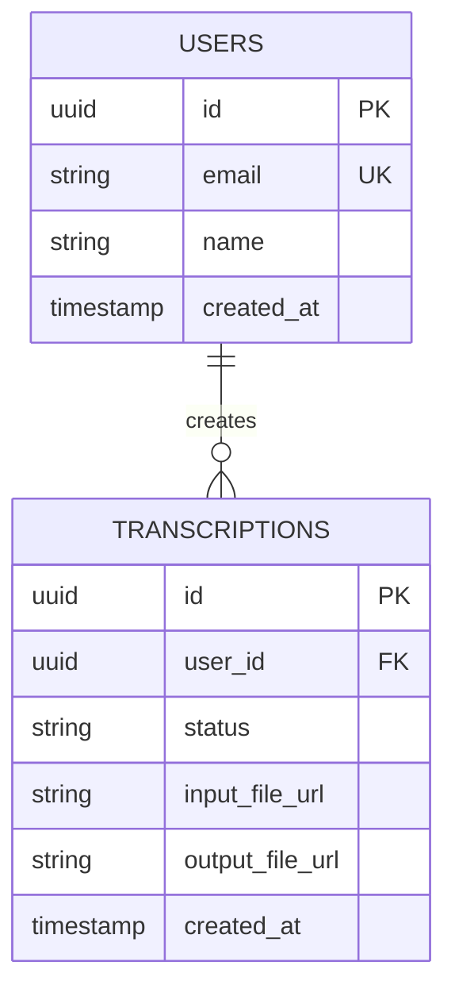

# ⚙️ MediSync-AI Backend

<div align="center">

[](https://nodejs.org/)
[](https://expressjs.com/)
[](https://www.mysql.com/)
[](https://aws.amazon.com/)

**Scalable, Secure, and Cloud-Native Backend for Medical Transcription Processing**

[API Documentation](./docs/api.md) •
[Database Schema](./docs/schema.md) •
[AWS Integration](./docs/aws.md)

</div>

---

## 🌟 Overview

The MediSync-AI backend is a robust, cloud-native API server that powers medical transcription processing and document management. Built with Node.js and integrated with AWS services, it provides secure, scalable, and reliable services for healthcare documentation.

### 🎯 Architecture Goals

> Building a scalable, maintainable, and secure backend that handles medical data with the highest standards of reliability and compliance.

## 💫 Key Features

### 🔐 Authentication & Authorization
- AWS Cognito integration
- JWT token management
- Role-based access control
- Session management
- MFA support

### 🎯 Core Services
- Medical audio processing
- Transcription management
- Document generation
- User management
- Analytics and reporting

### 🔄 Integration
- AWS HealthScribe
- Amazon S3 storage
- AWS Lambda functions
- Amazon RDS (MySQL)
- AWS Secrets Manager

### 📊 Monitoring
- CloudWatch integration
- Performance metrics
- Error tracking
- Audit logging
- Health checks

## 🛠️ Technology Stack

### Core Platform
- **Node.js**: Runtime environment
- **Express.js**: Web framework
- **TypeScript**: Type safety
- **MySQL**: Database (RDS)

### AWS Services
- **HealthScribe**: Medical transcription
- **S3**: File storage
- **Lambda**: Serverless functions
- **Cognito**: Authentication
- **RDS**: Database hosting
- **CloudWatch**: Monitoring
- **Secrets Manager**: Configuration

### Development Tools
- **Jest**: Testing framework
- **Swagger**: API documentation
- **ESLint**: Code quality
- **Docker**: Containerization
- **Terraform**: Infrastructure

## 🚀 Getting Started

### Prerequisites

```bash
node >= 18.0.0
npm >= 8.0.0
docker >= 20.10.0
aws-cli >= 2.0.0
```

### Development Setup

1. **Clone and Install**
```bash
git clone https://github.com/yourusername/MediSync-AI.git
cd MediSync-AI/backend
npm install
```

2. **Configure Environment**
```bash
# Copy environment template
cp .env.example .env

# Configure AWS CLI
aws configure
```

3. **Database Setup**
```bash
# Start local MySQL (if not using RDS)
docker-compose up -d db

# Run migrations
npm run migrate
```

4. **Start Server**
```bash
# Development mode
npm run dev

# Production mode
npm start
```

## 📁 Project Structure

```
backend/
├── src/
│   ├── config/           # Configuration files
│   ├── controllers/      # Request handlers
│   ├── middleware/       # Custom middleware
│   ├── models/          # Database models
│   ├── routes/          # API routes
│   ├── services/        # Business logic
│   │   ├── aws/        # AWS integrations
│   │   ├── db/         # Database operations
│   │   └── utils/      # Utility functions
│   └── types/          # TypeScript types
├── tests/              # Test suites
├── docs/              # Documentation
└── infrastructure/    # IaC templates
```

## 🔌 API Documentation

### Authentication Endpoints
```typescript
POST /api/auth/register
POST /api/auth/login
POST /api/auth/refresh
POST /api/auth/logout
```

### Transcription Endpoints
```typescript
POST /api/transcription/upload
GET /api/transcription/status/:id
GET /api/transcription/list
GET /api/transcription/:id
```

### User Management Endpoints
```typescript
GET /api/user/profile
PUT /api/user/profile
PUT /api/user/password
```

## 📊 Database Schema

### Enhanced Entity Relationship Diagram


## 🔒 Security Measures

### Authentication
- JWT token validation
- Role-based permissions
- Session management
- MFA implementation

### Data Protection
- End-to-end encryption
- HIPAA compliance
- Data anonymization
- Secure storage

### API Security
- Rate limiting
- Request validation
- SQL injection prevention
- XSS protection

## 📈 Performance Optimization

### Caching Strategy
- Redis caching
- Query optimization
- Connection pooling
- Response compression

### Scaling
- Horizontal scaling
- Load balancing
- Auto-scaling groups
- Database replication

## 🧪 Testing

```bash
# Unit tests
npm run test:unit

# Integration tests
npm run test:integration

# E2E tests
npm run test:e2e

# Coverage report
npm run test:coverage
```

## 📚 Available Scripts

```bash
# Development
npm run dev         # Start development server
npm start          # Start production server
npm run build      # Build TypeScript

# Database
npm run migrate    # Run migrations
npm run seed       # Seed database
npm run rollback   # Rollback migration

# Testing
npm test          # Run all tests
npm run lint      # Run linter
npm run format    # Format code

# Documentation
npm run docs      # Generate API docs
```

## 🔧 Configuration

### Environment Variables
```env
# Server Configuration
NODE_ENV=development
PORT=8080
API_VERSION=v1

# Database Configuration
DB_HOST=localhost
DB_PORT=3306
DB_NAME=medisync
DB_USER=admin
DB_PASSWORD=secret

# AWS Configuration
AWS_REGION=us-east-1
AWS_ACCESS_KEY_ID=your_access_key
AWS_SECRET_ACCESS_KEY=your_secret_key

# Authentication
JWT_SECRET=your_jwt_secret
JWT_EXPIRES_IN=24h

# AWS Services
S3_BUCKET=your_bucket_name
COGNITO_USER_POOL_ID=your_pool_id
COGNITO_CLIENT_ID=your_client_id
```

## 📝 Logging

### Log Levels
- ERROR: System errors
- WARN: Warnings
- INFO: General information
- DEBUG: Debug information
- TRACE: Detailed tracing

### Log Format
```json
{
  "timestamp": "2024-03-19T12:00:00.000Z",
  "level": "INFO",
  "message": "Request processed",
  "requestId": "123e4567-e89b-12d3-a456-426614174000",
  "method": "POST",
  "path": "/api/transcription/upload",
  "duration": 235
}
```

## 🤝 Contributing

See our [Contributing Guide](../CONTRIBUTING.md) for details.

## 📬 Support

- [Report Issues](https://github.com/yourusername/MediSync-AI/issues)
- [Feature Requests](https://github.com/yourusername/MediSync-AI/discussions)
- [API Support](https://medisync-ai.slack.com)

---

<div align="center">

**Built with ❤️ by the MediSync-AI Backend Team**

[Documentation](../docs) • [Frontend](../frontend) • [Infrastructure](../infrastructure)

</div> 